# Manual

This guide assumes you have succesfully [installed](installation.md) the program on your operating system.

/// warning
_We try to cover as much as possible in this guide, but feel free to contact the developers or submit an issue on [Github](https://www.github.com/ylseanna/QuakeView/issues) if you find anything that is not covered, so we can see if we can add support for a new feature or add a warning/further explanation to the documentation._
///

## Table of contents

[TOC]

## Importing earthquake catalog files

QuakeView is primarily an earthquake catalog visualisation program, hence the first step is almost always to load an earthquake catalog into the program. Catalogs are loaded as delimiter-seperated values text files, where currently supported delimiters are commas (CSV file format) and whitespaces.

/// details | **Usage tip:** Input catalogs
    type: tip

Always inspect catalogs before loading them into QuakeView. Sometimes - particularly when working cross-platform - file formats may get confused, special characters may invalidate entries, or missing values (e.g. `NaN`) can invalidate entries that have to be set, such as location or time parameters. Currently, QuakeView ignores missing magnitude values.
///

To select a file, hit the "Choose file" button in the configuration tab (see: [Figure 1](#file-loading)), a native file selection window will open allowing you to select the file. The file will then get listed on the same page. The entry in the list will have an icon to expand the item en start further configuring the file, and the another icon to remove the file.

If your selected file shows up in the list with a yellow warning icons, it means that your file parsing parameters are not yet [set correctly](#parsing-configuration), yet.

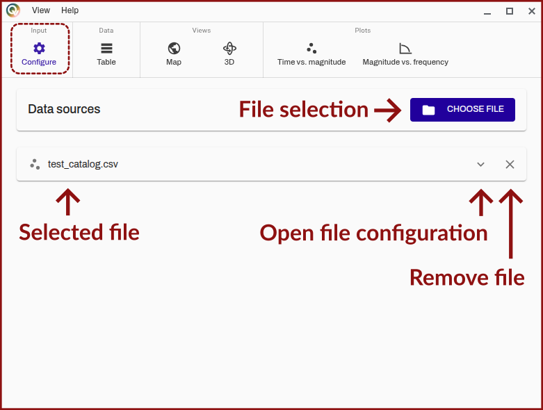
/// figure-caption | #file-loading
Screenshot of QuakeView of the "configure tab" annotated to show relevant buttons and other elements of the view for initial file loading.
///

### File configuration

You can configure relevant parameters for any loaded catalogue by expanding the catalog tab ([Figure 1](#file-loading), "open file configuration").

#### File overview

The top-most pane in the earthquake catalog configuration tab ([Figure 2](#file-overview)) is an overview of the base parameters for the earthquake catalog (name, file location, number of events/rows in the file). The visible name in the program can be configured by clicking on it.

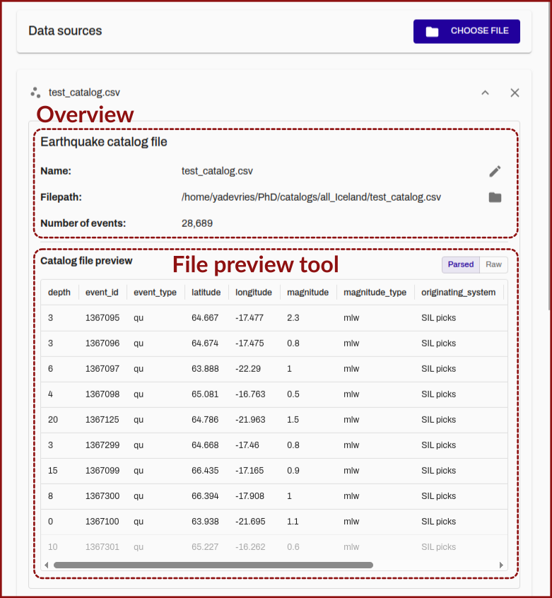
/// figure-caption | #file-overview
Screenshot of QuakeView of the "configure tab" annotated to show relevant buttons and other elements of the view for initial file loading.
///

To help with file parsing configuration a preview of the first ten rows of the catalog is shown below the initial pane. You can toggle between a parsed (i.e. with the currently set parsing parameters) and "raw" plain-text preview.

#### Parsing configuration

The next pane is a menu for configuring the parsing of the file. The top-most elements set the most basic parsing parameters:

- whether a listed id is used to uniquely identify the earthquakes or whether an programatically assigned increasing integer id is used.
- the delimiter (comma or whitespace)
- how the dates are listed in the catalogue, varying between as a single datetime string, seperate date and time strings or individual columns for year, month, day, hour, minute and second values.

Below these options is a table for setting the individual per earthquake parameter parsing parameters. Initially only the minimum required parameters are listed (id, date, longitude, latitude, depth, magnitude).

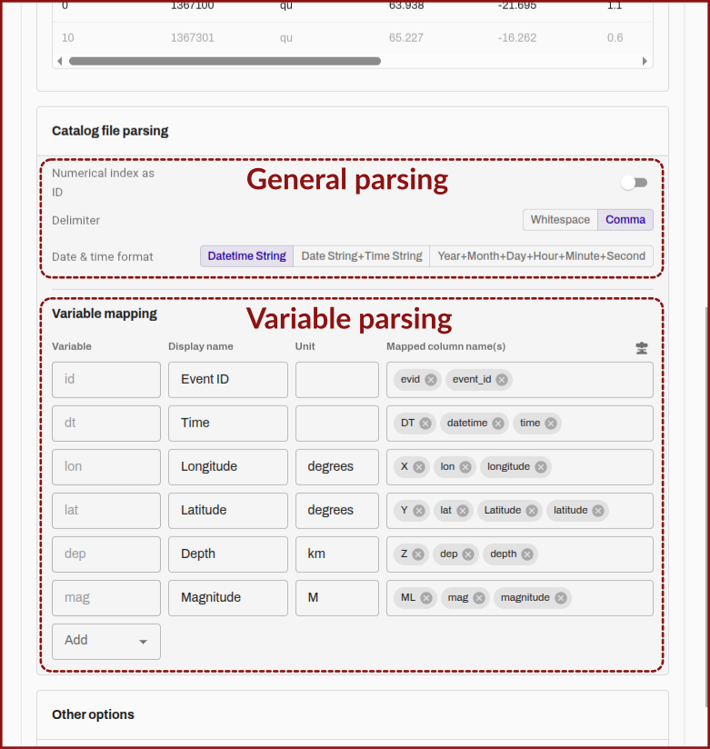
/// figure-caption | #file-parsing
Screenshot of QuakeView of the "configure tab" annotated to show relevant buttons and other elements of the view for initial file loading.
///

The columns of the table are:

- **Variable:** A simple name of the variable as it is interpreted by QuakeView.
- **Display name:** The name that will be shown in graphs or the information tool when selecting a single earthquake.
- **Unit:** A human-readable name of the unit for the parameter.
- **Mapped column names** A list of the column names that are looked for in the catalogue file (favoring those earlier in the list) to use as the column for the respective parameter. Some parameters are given initially as defaults, but they can be removed.

While they may not be immediately visible in the software, it is possible to add further columns to include in the loading into QuakeView (by default all other columns are ignored), and these can then be queried using the information tool and used for [color mapping](#formatting-tab).

To add an additional variable you select the relevant column name from the drop-down that will pop-up when the "add" element is clicked in the "variable" column. The added variable will then be added to the table.

## Table view

The second page of QuakeView ([Figure 4](#table-view)) is a table view of the loaded earthquake catalogs, it will show only the loaded parameters for each catalog, and has some utilities such as sorting by value and downloading the reduced catalog.

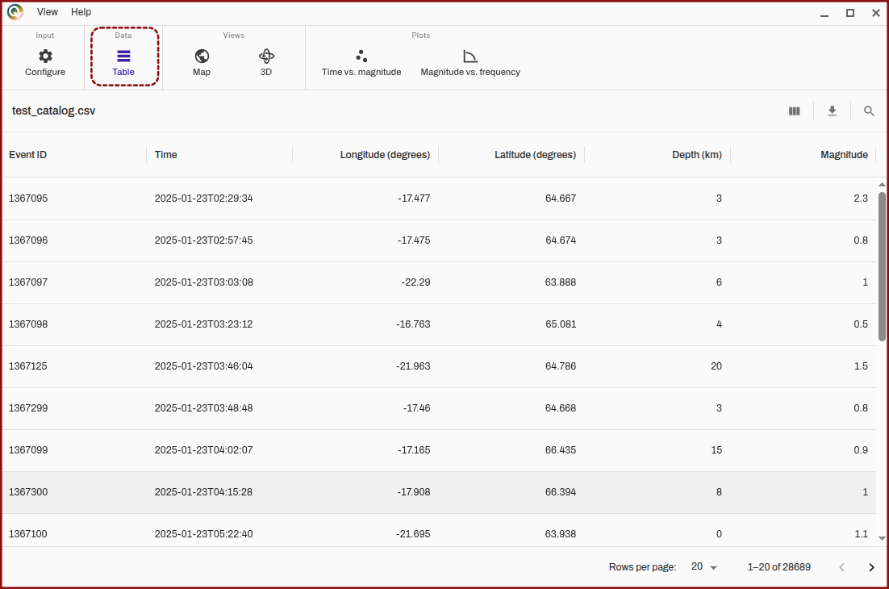
/// figure-caption | #table-view
Screenshot of QuakeView of the "table" tab with the table view visible.
///

## Map views

The map views are the primary visualisation elements in QuakeView, many of their features are shared between them and the plotting views. QuakeView has a [common configuration tabs](#visualisation-customization) for these visualisation views, treated in their own sections, the following sections will just go over the primary controls for these views.

### Map view (2D)

When the map view is opened you will see a map ([Figure 5](#map-view)) whose extent is set to the extents of the catalogs selected with the earthquakes visible as dots. Note that the visibility of the user interface (UI) elements can be toggled in the ["view" menu](#view-menu) on the toolbar.

/// tip | Spatial extent
If your catalogs span a large area, the individual point size may be too small and nothing may be visible. You can try [setting](#formatting-tab) a larger point size.
///

These UI elements include a legend for the catalogs loaded, [map controls](#map-controls) (next section), [side bar tabs](#sidebars), and a bottom bar that includes a button to open the [timeline bar](#timeline-bar) (the latter elements are covered in a later sections).

You can navigate the map by panning using the mouse (click with ++left-button++ and drag), zooming using the scroll wheel, and by using the arrow keys (++arrow-up++, ++arrow-down++, ++arrow-left++, ++arrow-right++). By pushing ++control++ and dragging the map can be rotated.

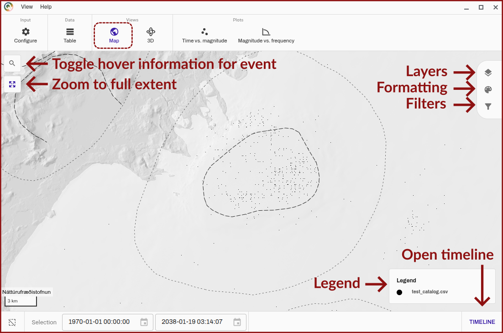
/// figure-caption | #map-view
Screenshot of QuakeView of the "map" tab with the map view visible, it is annotated to reference some of the user interface elements that are notable.
///

#### Map controls

In the top-right ([Figure 5](#map-view)) you see two buttons, the top-most button activates the information tool for querying information for a single earthquake when the mouse is hovered over it, this will then list any parameters that were added during the [configuration](#file-configuration).

The button below is set to reset the view, and zoom to the full extent of a all the loaded catalogs.

### 3D view

The 3D view is very similar to the [map view](#map-view) (see this section for a fully annotated run-through of the UI elements), except that some extra controls have to be enabled to allow for navigating the 3D space ([Figure 6](#threeD-view)).

/// tip | Spatial extent
If your catalogs span a large area, the individual point size may be too small and nothing may be visible. You can try [setting](#formatting-tab) a larger point size.
///

The overal view paradigm is based on a standard map view (think [OpenStreetMap](https://www.openstreetmap.org) or [Google Maps](https://maps.google.com)) where panning and dragging moves the view around in in the longitude-latitude plane (a virtual ground plane). To enable the view to go below the surface/sea level (or above) in QuakeView, the ++page-up++ and ++page-down++ buttons are used to move the ground plane of the view up and down respectively. By pushing ++control++ and dragging the view can be rotated. Using the scroll wheel you can zoom towards or a way from the ground plane.

/// details | **Virtual ground plane disclaimer**
    type: warning
Since it can be challenging to "see" where the invisible ground plane is, eventually a better indicator of this ground plane will be added. You can monitor [the Github issue](https://github.com/ylseanna/QuakeView/issues/10) to see the progress on this.
///

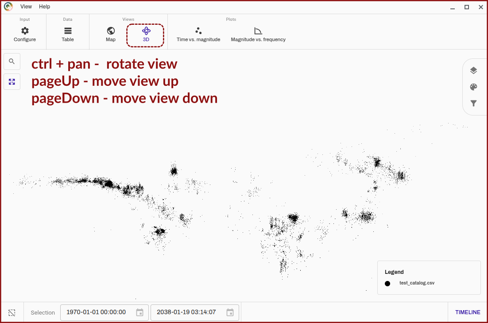
/// figure-caption | #threeD-view
Screenshot of QuakeView of the "3D" tab with the 3D view visible, it is annotated to list some extra button necessary for the 3D navigation in this section.
///

## Plotting views

QuakeView can generate dynamic plots based on the loaded catalogs. They have some [configuration tabs](#visualisation-configuration) in common with the [mapping views](#map-views) (their sections provide some additional information about buttons etc.).

### Time vs. magnitude plot

The time vs. magnitude plot ([Figure 7](#timevsmagnitude-view)) is meant to mirror a traditional stem plot for displaying the temporal evolution of earthquakes in a catalog. The formatting can be configured using the [sidebars](#sidebars), and it is important to note that the plot is dynamically zoomable (including the date formatting in the bottom), to enable the view to focussed on a particular area.

The current implementation of the time vs. magnitude plot is a stand-alone version of the [timeline plot](#timeline-bar).

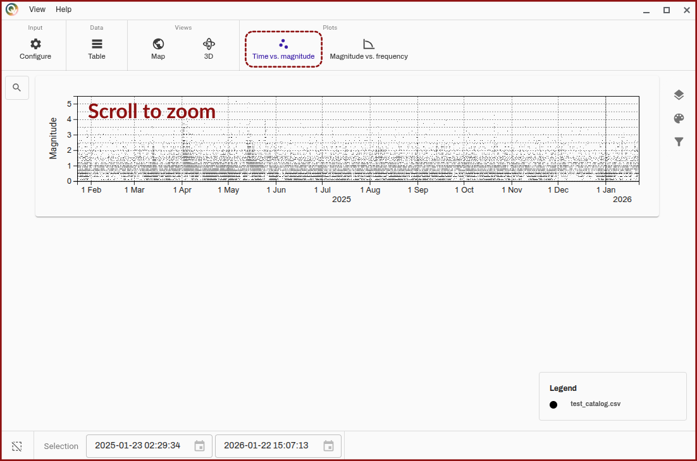
/// figure-caption | #timevsmagnitude-view
Screenshot of QuakeView of the "Time vs. magnitude" tab with the time vs. magnitude plot visible. It is pointed out that the plot can be dynamically zoomed.
///

### Magnitude vs. frequency plot

The magnitude vs. frequency plot ([Figure 8](#magnitudevsfrequency-view)) is a static plot that allows a cursory check of the general trends in the magnitude distribution in the loaded catalogs, as these should typically follow the [Gutenberg-Richter relation](https://en.wikipedia.org/wiki/Gutenberg%E2%80%93Richter_law) and may give an indication of the magnitude of completeness of the catalog.

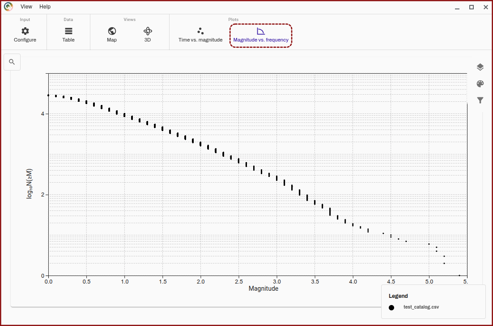
/// figure-caption | #magnitudevsfrequency-view
Screenshot of QuakeView of the "Magnitude vs. frequency" tab with the magnitude vs. frequency plot visible.
///

## Visualisation configuration

The following sections are concerned with the interface elements that are used across the QuakeView app to change common parameters for formatting, layer visibility, filtering, both static filtering and dynamic animatable filtering.

### Timeline bar

The timeline bar ([Figure 9](##timelinebar-view)) can be opened by hitting the "timeline" button in the bottom right. The timeline bar will show a time vs. magnitude plot that allows the checking of the temporal evolution of the loaded catalogs, which mirrors the [time vs. magnitude plot](#time-vs-magnitude-plot).

The plot can be zoomed into by using the scroll wheel, except when the selection mode is toggled to be on ([Figure 9](##timelinebar-view), "toggle selection mode"). When the selection mode is toggled, zooming is disabled but clicking and dragging allows for a time period of the plot to be selected, where the map will then only display the earthquakes that are within this period.

The bottom bar elements ([Figure 9](##timelinebar-view), "selection overview") will show the exact time periods selected.

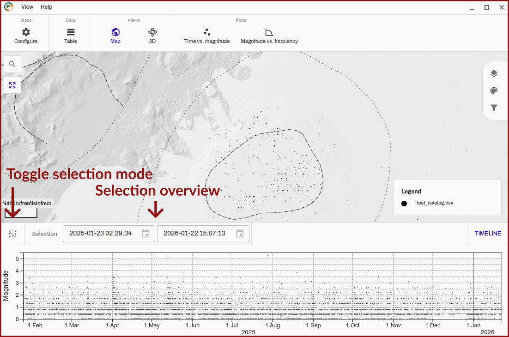
/// figure-caption | #timelinebar-view
Screenshot of QuakeView of the "map" tab with the timeline bar opened and visible, buttons relevant to the selection mode are highlighted.
///

#### Selection area controls

When an area is selected it is possible to drag the area bag and forth. It is also possible to animate the selection area and move it through time, which enables the user to easily visualise the temporal evolution of the catalog. The animated area will reset to the start of the catalog when it exits the viewing area (changes dynamically based on zoom).

The animation controls include a play and pause button, a speed controller (which is clamped to take into account possibly changing rendering time, i.e. it should work in proper time), and finally a button to make the size of the earthquake dots taper off towards the end of the selected period, allowing for a clear "popping-in" of the latest earthquakes.

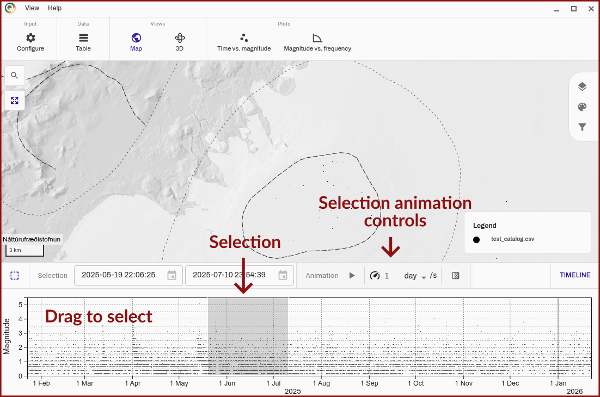
/// figure-caption | #timelinebar-controls-view
Screenshot of QuakeView of the "map" tab with the timeline bar opened and visible, more precise controls for the selected area are shown, including animation elements.
///

### Sidebars

The sidebars contain the per-layer configuration that is typically common to the whole app, although it may sometimes be split by type of visualisation. Upon clicking any of the buttons (See, for instance, [Figure 5](#map-view), top right), the side panel will open. The following sections are concerned with the configuration available in these tabs.

/// warning | Undiscovered lands
The following sections are not fully written yet... Sorry for the inconvenience, but I hope the images provide some context already!
///

#### Layer tab

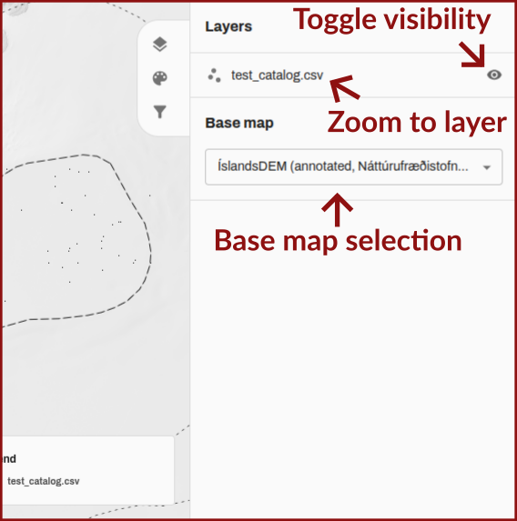

#### Formatting tab

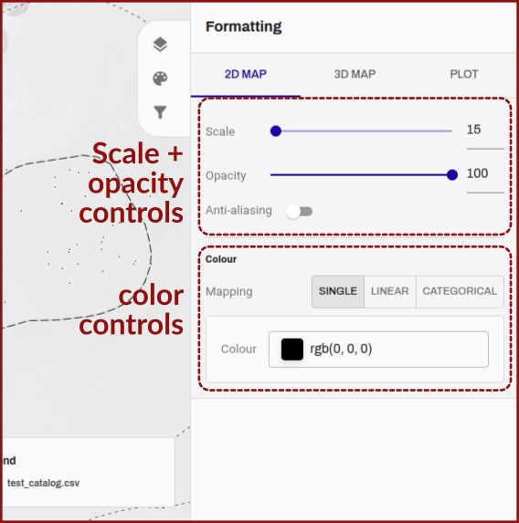

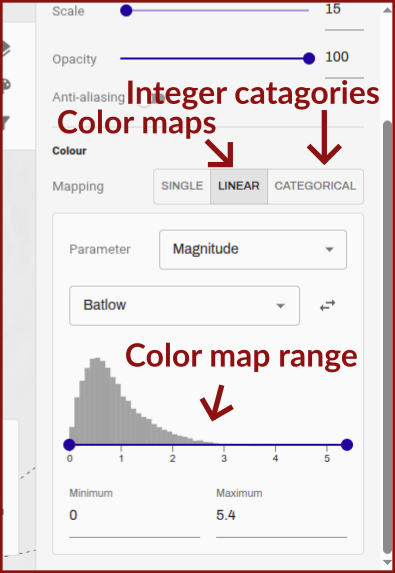

#### Filtering tab

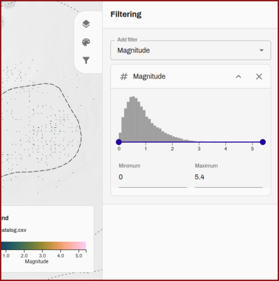

## App configuration

### View menu

### Help menu

